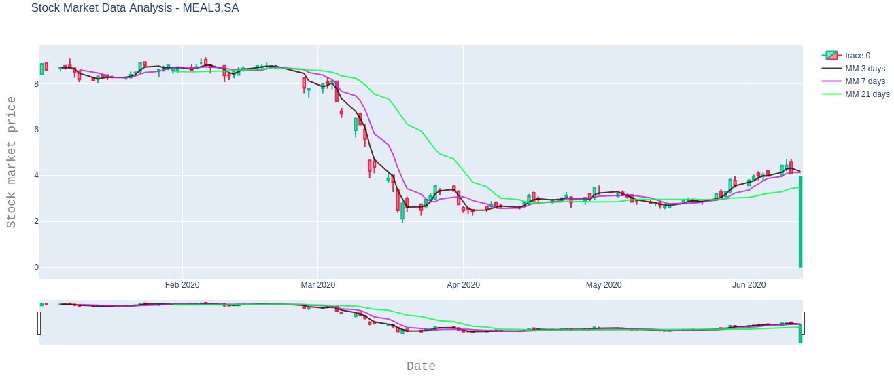

# Stock Market Data Analysis

### Install linux dependencies

```shell script
sudo apt update
sudo apt install build-essential \
                 software-properties-common \
                 python3-pip \
                 python3-distutils
```

### Create environment and install python dependencies

```shell script
pip3 install virtualenv
virtualenv venv
source venv/bin/activate
pip install -r requirements.txt
```

### Preview

